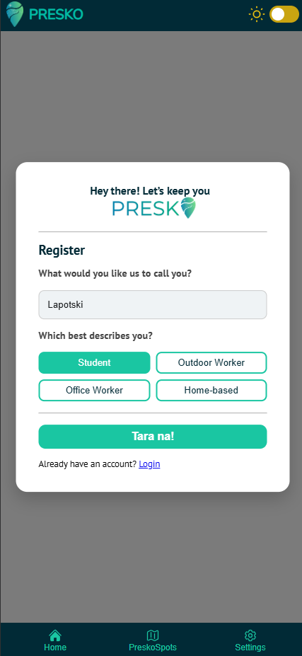
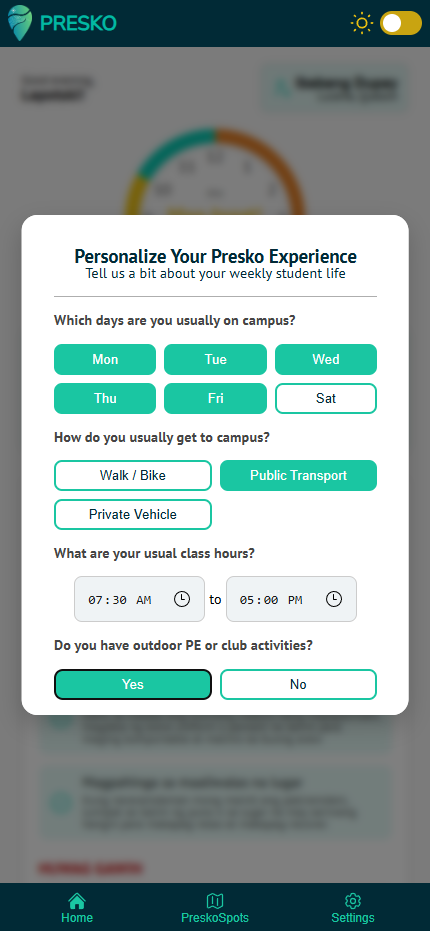
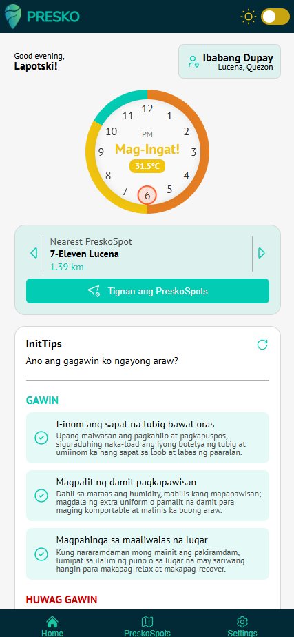
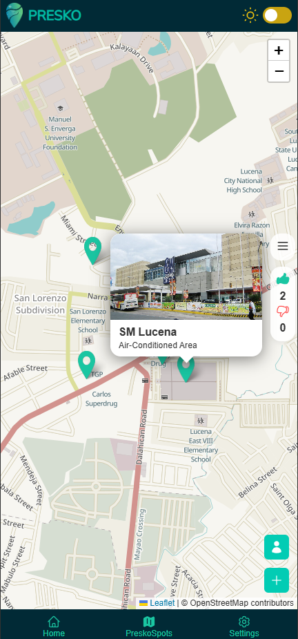
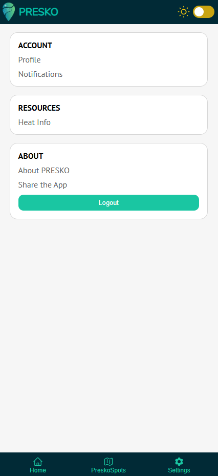
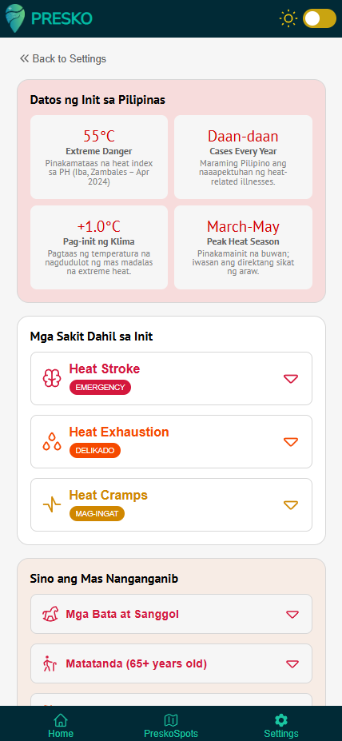

[![Contributors][contributors-shield]][contributors-url]
[![Forks][forks-shield]][forks-url]
[![Stargazers][stars-shield]][stars-url]
[![project_license][license-shield]][license-url]

<!-- PROJECT LOGO -->
 

  

<h3 align="center">PRESKO</h3>

  

    Welcome to PRESKO, your go-to platform for <b>real-time local heat indices</b> and discovering nearby <b>cooling/hydration spots</b> tailored for different user types—students, outdoor workers, office workers, and home-based users.
     
    <a href="https://github.com/neophiles/KlimaTech"><strong>Explore the docs »</strong></a>
     

<!-- TABLE OF CONTENTS -->

  
Table of Contents

  <ol>
    <li>
      <a href="#about-the-project">About The Project</a>
      <ul>
        <li><a href="#built-with">Built With</a></li>
      </ul>
    </li>
    <li><a href="#features">Features</a></li>
    <li><a href="#screenshots">Screenshots</a></li>
    <li><a href="#installation">Installation</a></li>
    <li><a href="#license">License</a></li>
    <li><a href="#contact">Contact</a></li>
    <li><a href="#acknowledgments">Acknowledgments</a></li>
  </ol>

<!-- ABOUT THE PROJECT -->
## About The Project

[![Presko_Logo Screen Shot][Presko-screenshot]](https://github.com/neophiles/KlimaTech/blob/main/frontend/public/logo/name_logo.png)

PRESKO is a web-based, mobile-first application that provides real-time local heat indices and personalized dashboards based on user type — such as students, outdoor workers, office employees, and home-based users.
With tailored “InitTips”, Presko helps users adapt their daily routines to the weather and stay safe during rising temperatures.

The app also features an interactive map that helps users locate the nearest “PreskoSpots” — designated cool areas or safe zones where people can rest, recover, and stay hydrated during extreme heat.

### Built With

Frontend:
- [![React][React.js]][React-url]

Backend:
- [![Python][Python]][Python-url]
- [![FastAPI][FastAPI]][FastAPI-url]

Database:
- [![PostgresSQL][Postgres]][Postgres-url]

APIs:
- **Open-Meteo** for weather data
- **OpenStreetMap** for maps

<!-- FEATURES -->

## Features
- **Real-time local heat index** updates
- **Personalized dashboards** for different user types for personalized Init Tips.
- **Map view**: locate the nearest Presko spots for hydration or cooling
- Mobile-first, responsive design
- Dynamic color-coded dashboard 
- Optional notifications based on heat index thresholds

<!-- SCREENSHOTS -->
## Screenshots

  <h3>Onboarding</h3>
   
   
  

  <h3>Dashboard</h3>
  
  

  <h3>Map</h3>
  
  

  <h3>Settings</h3>
  
  

  <h3>Heat Info</h3>
  

<!-- INSTALLATION -->
## Installation

To get a local copy up and running, see `instructions.txt` for more information.

<!-- LICENSE -->
## License

Distributed under the project_license. See `LICENSE.txt` for more information.

(<a href="#readme-top">back to top</a>)

<!-- MARKDOWN LINKS & IMAGES -->
<!-- https://www.markdownguide.org/basic-syntax/#reference-style-links -->
[contributors-shield]: https://img.shields.io/github/contributors/neophiles/KlimaTech.svg?style=for-the-badge
[contributors-url]: https://github.com/neophiles/KlimaTech/graphs/contributors
[forks-shield]: https://img.shields.io/github/forks/neophiles/KlimaTech.svg?style=for-the-badge
[forks-url]: https://github.com/neophiles/KlimaTech/network/members
[stars-shield]: https://img.shields.io/github/stars/neophiles/KlimaTech.svg?style=for-the-badge
[stars-url]: https://github.com/neophiles/KlimaTech/stargazers
[license-shield]: https://img.shields.io/github/license/neophiles/KlimaTech.svg?style=for-the-badge
[license-url]: https://github.com/neophiles/KlimaTech/blob/main/LICENSE.txt
[Presko-screenshot]: frontend/public/logo/name_logo.png
<!-- Shields.io badges-->
[React.js]: https://img.shields.io/badge/React-20232A?style=for-the-badge&logo=react&logoColor=61DAFB
[React-url]: https://reactjs.org/
[Postgres]: https://img.shields.io/badge/Postgres-%23316192.svg?logo=postgresql&logoColor=white
[Postgres-url]: https://www.postgresql.org
[FastAPI]: https://img.shields.io/badge/FastAPI-009485.svg?logo=fastapi&logoColor=white
[FastAPI-url]: https://fastapi.tiangolo.com
[Python]: https://img.shields.io/badge/Python-3776AB?logo=python&logoColor=fff
[Python-url]: https://www.python.org
